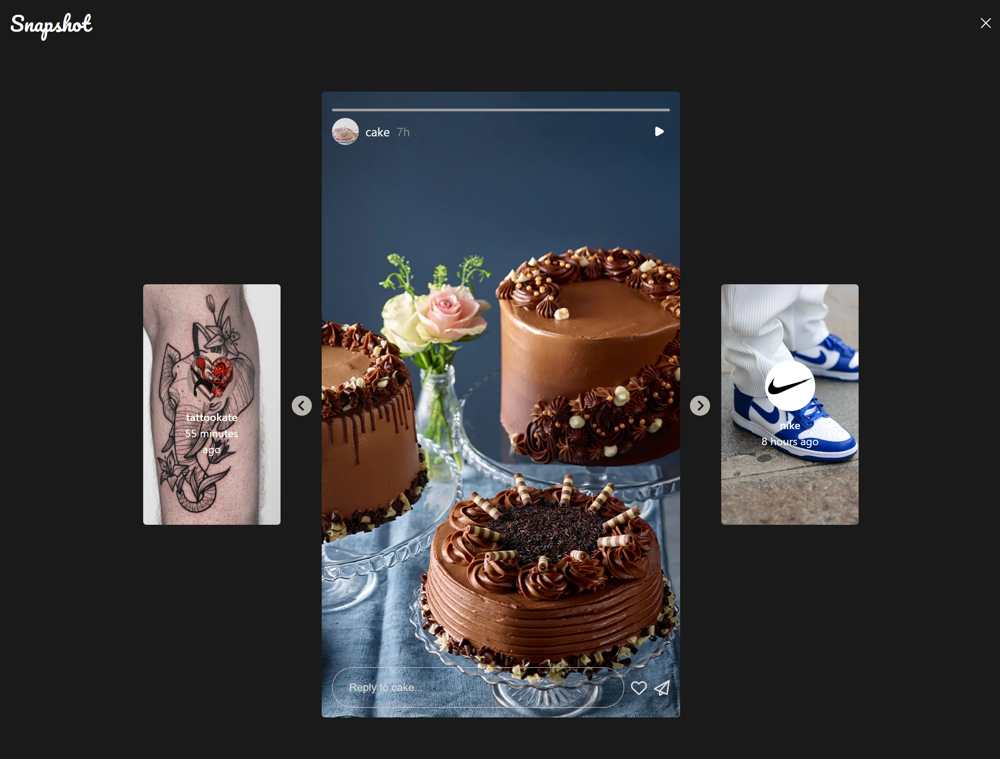

<h1 align="center"> Snapshot - An awesome Instagram clone </h1>

<p> Welcome to Snapshot! A fully-featured Instagram clone built entirely from scratch with Angular, Node.js, and SQL. This project is an excellent demonstration of my ability to design, develop and deploy a responsive, beautiful and fully-functional app using Object-Oriented Programming, SQL queries and a variety of other technologies. Snapshot is a complete social media platform that includes all the core features you would expect from an Instagram clone, such as user authentication, image uploads, likes, comments, and more. The user interface is designed to be intuitive, easy to use, and responsive, and the back-end is built to handle large amounts of data and traffic. The codebase is well-organized, easy to understand and customize, making it an ideal starting point for anyone looking to build their own social media application.<p>

<p>Snapshot is a personal project that I, the author, have built from scratch with the exception of the initial stages where I received invaluable assistance from my friend Tal to help me get started. As the project progressed, I received further technical support from my brother Oren in building the backend and API for the SQL database. Although I am the main developer of the project, I couldn't have done it without their contributions. Their support and expertise were integral in bringing Snapshot to life and I am grateful for their help in making this project a reality.</p>

 You can check it out [here ](https://snapshot-zzha.onrender.com/#/).


### Table of Contents
- [Snapshot Description](#snapshot-description)
- [Application Features](#application-features)
- [Technologies](#technologies)
- [Getting started:](#getting-started)
- [Deployment](#deployment)
- [Showcase](#showcase)
- [Author](#author)
- [Contributors](#contributors)

## Snapshot Description
Snapshot is a social media app that places a strong emphasis on pictures. As the old saying goes, "one picture is worth a million words." 
This is evident in the app's features, which are designed to make it easy for users to upload, share, and discover pictures. 
The app's main feature is the ability to create posts by uploading pictures and adding captions. 
Users are required to attach at least one photo to the post, and the photos can be customized with a crop tool and color filters. 
This allows users to express themselves and share their experiences in a visual way.

In addition to creating posts, users can also engage with the content by leaving comments, starting conversations, and showing appreciation through likes. 
The app's commenting feature allows users to leave their thoughts and opinions on other users' posts, while the likes feature allows users to show support and appreciation for the content. 
The app also has a feature of hashtags, which makes it easy for users to discover content related to a specific topic. 
Hashtags also make it easier for users to find and follow content that interests them.

Another feature that is unique to Snapshot is location tagging. This allows users to tag their location when posting a picture or story, enabling them to share where they are and what they are doing, and also allows other users to discover content from a specific location. 

The app also allows users to upload a story, which is a picture, customize it with text, drawing or stickers, and it will be uploaded and available for viewing on the app for 24 hours. 
After 24 hours the story will be archived, but you can still attach it to your profile at your personal profile page, and it will be saved as a highlight to your profile.

Users can also personalize their profiles by adding a bio, a profile picture, and a cover photo. This feature allows users to express themselves and showcase their personal brand. 
The app also has a search function that makes it easy for users to find and follow content and people that interest them. 

Users will also receive push notifications when someone likes, comments or messages them, keeping them engaged and informed about the activity on their posts. 

The app also has a message page where you can chat with other users online, and create personal relationships. 

And, last but not least, the app is optimized for all screen sizes and devices, allowing users to access and use the app on any device and has a dark mode feature for a sleek and modern aesthetic in low-light environments.

## Application Features
 - **Creating posts**: Users can upload pictures and add captions to create new posts. Users are required to attach at least one photo to the post. The photos can be customized with a crop tool and color filters.
 - **Commenting**: Users can leave comments on other users' posts. This feature allows users to engage with the content and start conversations.
 - **Likes**: Users can like other users' posts. This feature allows users to show appreciation for the content and support for the user who posted it.
 - **Hashtags**: Users can add hashtags to their posts, making it easier for others to discover content related to a specific topic. Hashtags also make it easier for users to find and follow content that interests them.
 - **Location tagging**: Users can tag their location when posting a picture or story. This feature allows users to share where they are and what they are doing, and also allows other users to discover content from a specific location.
 - **Stories**: Users can upload a picture, customize it with text, drawing or stickers, and it will be uploaded and available for viewing on the app for 24 hours. After 24 hours the story will be archived, but you can still attach it to your profile at your personal profile page, and it will be saved as a highlight to your profile.
 - **User profiles**: Users can personalize their profiles by adding a bio, a profile picture, and a cover photo. This feature allows users to express themselves and showcase their personal brand.
 - **Search function**: Users can search for other users and hashtags. This feature makes it easy for users to find and follow content and people that interest them.
 - **Push notifications**: Users will receive notifications when someone likes, comments or messages them. This feature keeps users engaged and informed about the activity on their posts.
 - **Message page**: As a social network Snapshot has a message page where you can chat with other users online, and create personal relationships.
 - **Direct messaging**: Users can send private messages to other users. This feature enables users to communicate with each other in a more intimate setting.
 - **Responsive design**: The app is optimized for all screen sizes and devices, allowing users to access and use the app on any device.
 - **Dark mode**: The dark mode feature on Snapshot allows users to switch to a darker color scheme on the app, reducing eye strain and making it easier to use in low-light environments. It also provides a sleek and modern aesthetic for users who prefer a darker theme.

 
## Technologies
- SQLite3
- Express
- Node.js
- Rest API
- Angular
- Sass
    
## Getting started:

* Clone the repository
* Run the following commands to run the backend:

```
$ cd backend
$ npm i
$ npm run dev
```

* Run the following commands to run the frontend:

```
$ cd frontend
$ npm i
$ ng serve
```

## Deployment

In the `frontend` diretory, execute: `ng build`

Copy the `dist/build` directory to the backend's `public` diretory and push that to your production server.


## Showcase

### Home page
The landing page in which the user can view his and the followed users posts and stories.


In Dark mode.


### Story page
In the Story page, the user and watch and scroll through his and his followed users stories.



### Search modal
The Search modal, where the user can search for users and hashtags from the data base.


### Explore page
The Explore page, where the user can scroll through posts from random users he doesn't follow.


### Messages page
In the messages page, the user can create chat rooms and converse with other users.


### Notifications modal
The Notifications modal, is where all of the user push notifications are stored.


### Create post modal
In the create post modal, the user can upload and customize his post.


### Profile Page
The profile page contains the user posts, posts saved for later view, posts the user was tagged in, and the user followers and followed profile lists.


### Some mobile!
Just a taste of the mobile experience. We used different **mixins**, **conditional rendering**, and the **"mobile first"** approach. 


### Author
 - [Eshel Eyni](https://github.com/EshelEyni)

 ### Contributors
 - [Tal Elmaliach Hemo](https://github.com/TalElmaliachHemo)
 - [Oren Eini](https://github.com/ayende)
